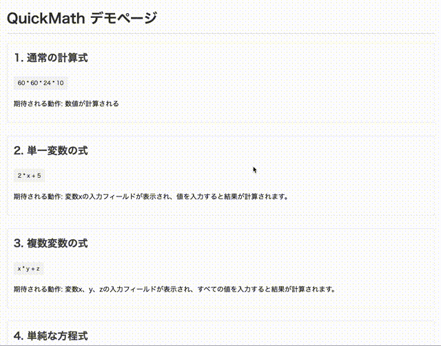

# QuickMath

## これは何？

- ブラウザ上で表示された数式を右クリックから計算するだけの chrome extension です
- どのようなウェブサイトの背景色でも計算結果が見やすく表示されるよう、適応型カラースキームを採用しています
- 変数を含む式や方程式も処理できます

## 特徴

- 選択したテキストを数式として計算
- ウェブサイトの背景色を自動検出し、最適なコントラストでポップアップを表示
- 明るい背景では暗いポップアップ、暗い背景では明るいポップアップを表示
- 変数を含む式（例：`2 * x + 5`）の場合、インタラクティブな入力フィールドを表示
- 方程式（例：`2 * x + 5 = 15`）の場合、自動的に解を計算

## 使い方

### 通常の数式

1. ウェブページ上で計算したい数式を選択（例：`12 + 34 * 2`）
2. 選択した部分を右クリック
3. 「数式を計算する」をクリック
4. 結果がポップアップで表示されます

### 変数を含む式

1. 変数を含む式を選択（例：`2 * x + 5`）
2. 右クリックして「数式を計算する」を選択
3. ポップアップに変数の入力フィールドが表示されます
4. 変数の値を入力すると、リアルタイムで結果が更新されます

### 方程式

1. 方程式を選択（例：`2 * x + 5 = 15`）
2. 右クリックして「数式を計算する」を選択
3. 方程式の解がポップアップに表示されます

#### サポートされている方程式のタイプ

- **線形方程式**: `ax + b = c` の形式（例: `2x + 5 = 15`）
- **二次方程式**: `ax² + bx + c = 0` の形式（例: `x² - 4 = 0`）

注意: より複雑な方程式は現在サポートされていません。

## 使用している技術類

- [Math.js](https://github.com/josdejong/mathjs)

## テスト

拡張機能の動作確認には以下のテストページが利用できます：

- `extension_test/test_page.html` - 基本的な数式のテスト
- `extension_test/test_backgrounds.html` - 様々な背景色での表示テスト
- `extension_test/variable_test.html` - 変数計算と方程式のテスト（線形・二次方程式のサンプルを含む）
